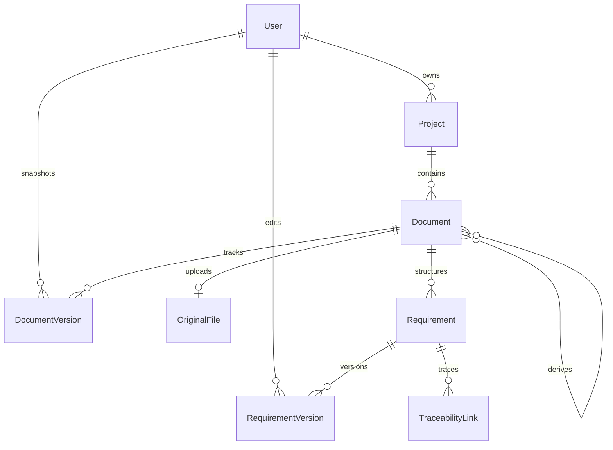

# DocuMan 🚀

**DocuMan** is a next-generation, AI-powered requirements engineering workspace designed to automate the extraction, management, versioning, and traceability of technical documentation. Whether parsing complex requirements documents, generating MIL-STD-498 compliant derivatives, or resolving suspect traceability links, DocuMan provides a structured, interactive, and AI-assisted environment for modern systems engineering.

---

## 🌟 Key Features

### 1. Automated AI Document Parsing & Extraction
* **Multi-Format Support**: Upload files in **PDF**, **DOCX**, or **TXT** formats.
* **Intelligent Chunked Extraction**: Processes entire documents of any length without static truncation.
* **Structured Categorization**: Automatically groups document elements into `TITLE` (headings), `REQUIREMENT` (specifications/shall-statements), `PARAGRAPH` (descriptive text), and `NOTE` (remarks).
* **Automatic Item Numbering**: Automatically detects or structures hierarchically nested item numbers (e.g., `3.2.1`).

### 2. Multi-Pane Interactive Requirement Editor
* **Inline Editing**: Modify requirements directly within the structured document view.
* **Real-time Filtering**: Locate requirements instantly using live text search.
* **Granular Versioning**: Tracks changes at both the document level and the individual requirement level. Revert or audit edits with ease.
* **Workflow Management**: Transition documents through states (`DRAFT` ➔ `REVIEW` ➔ `PUBLISHED`). Published documents freeze revisions as read-only snapshots under a new major version number.

### 3. Context-Aware AI Chat Assistant
* **Contextual Referencing**: Hover and click on any requirement to load it directly into the AI editing panel.
* **AI-Assisted Redrafting**: Ask the AI to rewrite, expand, simplify, or verify compliance for a specific requirement.
* **AI-Driven Additions**: Add new requirements generated with the assistant, automatically placed in the correct hierarchy.

### 4. Traceability & Suspect Link Management
* **Requirement-Level Linking**: Link derived requirements to original source documents (e.g., mapping System Requirements to Stakeholder Needs).
* **Trace Types**: Supports multiple link relationships (`DERIVED_FROM`, `SATISFIES`, `RELATED_TO`).
* **Suspect Link Flags**: Automatically flags downstream links as "suspect" when parent requirements are modified, prompting immediate verification of trace integrity.

### 5. Custom Document Exporting
* **HTML & CSS Templates**: Define structured templates using Handlebars.
* **Puppeteer PDF Rendering**: Generate professional PDF exports with custom styling, headers, and footers.
* **Traceable Dataset Exports**: Export datasets containing derived item numbers and trace metrics.

---

## 🛠️ Tech Stack

* **Framework**: [Next.js 15](https://nextjs.org/) (App Router, Server Actions)
* **Frontend**: React 19, TypeScript, Tailwind CSS / Vanilla CSS
* **Database & ORM**: [Prisma ORM](https://www.prisma.io/) with SQLite (development) or PostgreSQL (production)
* **AI Integration**: [Vercel AI SDK](https://sdk.vercel.ai/docs) & `@ai-sdk/openai-compatible`
* **Parsing Utilities**: `pdf-parse`, `officeparser` (DOCX), standard text streams
* **Export Engine**: `puppeteer`, `handlebars`

---

## 📂 Project Structure

```bash
DocuMan/
├── prisma/                  # Prisma Database Schemas & Migrations
│   ├── dev.db               # SQLite Local Database (Auto-generated)
│   └── schema.prisma        # Database Models & Schema Definition
├── src/
│   ├── app/
│   │   ├── actions.ts       # Server Actions (CRUD for projects, docs, requirements)
│   │   ├── api/             # API Endpoints (AI Chat, Upload, Derive, Export)
│   │   ├── dashboard/       # Dashboard, projects list, editor, and traceability pages
│   │   ├── globals.css      # Core Design System, custom UI stylesheets
│   │   ├── layout.tsx       # Root layout
│   │   └── page.tsx         # Dashboard landing page
│   └── lib/
│       ├── ai/              # AI extractors, chat handlers, and derivative generators
│       ├── parsers/         # PDF, DOCX, TXT parser modules
│       └── db.ts            # Prisma Database client initializer
├── uploads/                 # Local directory for storing original files
├── Dockerfile               # Production container config
└── package.json             # NPM dependencies & build scripts
```

---

## ⚙️ Database Architecture

DocuMan uses a relational data model managed via Prisma:



* **User**: Handles basic authentication and ownership profiles.
* **Project**: Grouping boundary for documents and configurations.
* **Document**: Manages metadata, category (`SSS`, `SSDD`, `SRS`, `SDD`, `IRS`, `IDD`, `STP`, `CUSTOM`), lifecycle status (`DRAFT`, `REVIEW`, `PUBLISHED`), and major/minor version snapshots.

---

## 📜 Supported MIL-STD-498 & Superseding Standards

DocuMan provides first-class support for MIL-STD-498 and modern superseding standards (EIA/IEEE J-STD-016, IEEE 1016-2009, ISO/IEC/IEEE 15288, and ISO/IEC/IEEE 42010):

| Category | Standard Document Type | MIL-STD-498 DID | IEEE / ISO Superseding Standard | Purpose & Focus |
| :--- | :--- | :--- | :--- | :--- |
| **SSS** | System/Subsystem Specification | DI-IPSC-81431 | ISO/IEC/IEEE 29148 | High-level system & subsystem requirements |
| **SSDD** | System/Subsystem Design Description | DI-IPSC-81432 | IEEE 1016 / ISO 42010 | System architecture, HW/SW component breakdown (HWCIs/CSCIs), operational concept, and system interface matrices |
| **SRS** | Software Requirements Specification | DI-IPSC-81433 | IEEE 830 / ISO 29148 | Detailed software requirements for Computer Software Configuration Items (CSCIs) |
| **SDD** | Software Design Description | DI-IPSC-81435 | IEEE 1016-2009 | CSCI software unit internal design, functions, data structures, and algorithms |
| **IRS** | Interface Requirements Specification | DI-IPSC-81434 | ISO/IEC/IEEE 29148 | External system interface requirements |
| **IDD** | Interface Design Description | DI-IPSC-81436 | IEEE 1016 | Detailed physical & logical interface message schemas and pinouts |
| **STP** | Software Test Plan | DI-IPSC-81438 | IEEE 829 / ISO 29119 | Verification procedures, test environments, and qualification provisions |
* **Requirement**: The core building block; holds text, classification (`TITLE`, `REQUIREMENT`, `PARAGRAPH`, `NOTE`), and hierarchical layout indices (`indentLevel`, `sortOrder`).
* **RequirementVersion**: Historical audit log of individual requirement changes.
* **TraceabilityLink**: Joins source and target requirements. Flags `isSuspect` if the target or source requirement updates.

---

## 🚀 Getting Started

### Prerequisites
* **Node.js** (v18.x or later)
* **npm** (v9.x or later)
* An API key for an OpenAI-compatible model endpoint (e.g., OpenAI, DeepSeek, or Anthropic proxy).

### 1. Clone & Install Dependencies
```bash
git clone https://github.com/your-username/DocuMan.git
cd DocuMan
npm install
```

### 2. Configure Environment Variables
Copy `.env.example` to `.env` and fill in your keys:
```bash
cp .env.example .env
```

Review and update the variables:
* `DATABASE_URL`: Path to your database (defaults to local SQLite `file:./dev.db`).
* `AI_API_BASE_URL`: Base URL for OpenAI-compatible chat model API (e.g. `https://api.openai.com/v1`).
* `AI_API_KEY`: Your model API provider credential.
* `AI_MODEL`: Chat model to use (e.g., `gpt-4o`, `gpt-4-turbo`).
* `UPLOAD_DIR`: Path to the directory where uploads are stored (defaults to `./uploads`).

### 3. Initialize the Database
Run database migrations and seed default document export templates:
```bash
# Generate the Prisma client code
npm run db:generate

# Push schema directly to the SQLite database
npm run db:push

# (Optional) Seed built-in export templates
npm run db:seed
```

### 4. Start Development Server
```bash
npm run dev
```
Open **[http://localhost:3000](http://localhost:3000)** in your browser to view the application.

---

## 🛠️ API & Core Workflows

### AI Extraction Workflow
1. Upload a document in **Dashboard ➔ Upload**.
2. `src/lib/parsers/` reads the raw binary data.
3. `extractRequirements(text)` split the raw text into paragraph-aware chunks.
4. Each chunk is sent sequentially to the configured LLM with instructions to map unstructured text directly to Zod schemas matching `RequirementSchema`.
5. Extracted requirements are automatically nested and ordered inside the project database.

### Traceability Updates
* When you edit a requirement using the inline editor or AI assistant, `updateRequirement` in `src/app/actions.ts` runs.
* It saves a new snapshot to `RequirementVersion` and automatically toggles `isSuspect = true` in `TraceabilityLink` for any connected traces, signaling verification requirements.
