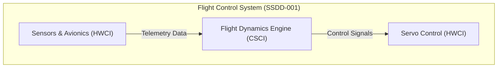

# DocuMan 🚀
### Next-Generation AI-Powered Systems Engineering & Requirements Management Workspace

**DocuMan** transforms complex engineering specifications into MIL-STD-498 and IEEE / ISO compliant technical documentation. By combining multi-pass AI reasoning, live architectural diagram rendering, cross-requirement function synthesis, and bi-directional trace link management, DocuMan empowers engineering teams to deliver military-grade system designs in a fraction of the time.

---

## ⚡ Why DocuMan?

| Pain Point in Traditional Engineering | The DocuMan Solution |
| :--- | :--- |
| **Manual Document Derivation**: Weeks spent translating SSS specs into SSDD / SRS documents. | **Automated 3-Pass AI Derivation**: Generates complete, compliant derived documents in minutes. |
| **Unclear System Boundaries**: Disconnected requirements lacking functional coherence. | **Smart Function Grouping**: Joins related requirements into cohesive System Functions with 4-row tables. |
| **Outdated Architecture Diagrams**: Static images that become obsolete after specification updates. | **Live Visual Mermaid Diagrams**: Responsive SVG architectural & data flow diagrams rendered live. |
| **Broken Traceability**: Silent requirement changes causing downstream compliance failures. | **Automated Suspect Link Flagging**: Instant visibility into affected downstream specifications. |

---

## 🌟 Features That Matter

### 🧠 3-Pass High-Precision AI Derivation Engine
DocuMan uses a multi-stage AI derivation pipeline to eliminate hallucinated architectures and guarantee structural integrity:
* **Pass 1 — Global Document Analysis**: Synthesizes executive summaries, extracts domain glossaries, and groups parent requirements into granular **System Functions** (`Fn-001`, `Fn-002`...).
* **Pass 2 — Architectural Pre-Pass Synthesis**: Establishes global architectural baselines FIRST for Section 1 (*Scope & Identification*), Section 2 (*Referenced Documents*), and Section 3 (*Architectural, Operational & Safety Decisions*).
* **Pass 3 — Detailed Requirement Breakdown**: Generates Section 5.2 Functional Architecture tables with exact 4-row formats (Function Name, Description, bulleted Inputs & Outputs with subfield data structures, and parent Requirement Reference IDs).

---

### 🎨 Live Visual Mermaid Architectural & Data Flow Diagrams
Bring system specifications to life with embedded visual diagrams:
* **Real-time SVG Rendering**: Renders responsive component breakdown diagrams (Section 4.1) and subsystem data flow diagrams (Section 4.3) directly in the Document Editor UI.
* **Code & Visual Toggles**: Seamlessly switch between visual SVG diagrams and editable Mermaid code blocks.
* **Vector PDF & HTML Exports**: Embedded Mermaid JS engine ensures exported PDFs and HTML files contain crisp, high-resolution vector diagrams for print and review.



---

### 🧩 Smart Cross-Requirement Function Grouping
Rather than generating 1-to-1 requirement clones, DocuMan's AI engine synthesizes related parent requirements (`SSS-001`, `SSS-002`, `SSS-005`) into cohesive **System Functions**:
* **Mandatory 4-Row Functional Tables**: Each function features an exact 4-row specification matrix:
  1. **Function Name**: `Fn-00X: [Function Title]`
  2. **Function Description**: Concrete algorithm and operational logic
  3. **Inputs / Outputs**: Bulleted parameter lists with explicit composite data subfields (e.g. `(subfields: sensor_id, fov_deg, timestamp)`)
  4. **Upstream Requirements**: Human-readable trace references (`SSS-001`, `SSS-004`)

---

### 📡 Automated Interface Summaries & Signal Data Dictionaries
DocuMan automatically extracts and structures system interfaces across all documentation layers:
* **Section 4.3 System Interface Summary Tables**: Outlines source/target subsystems, protocol buses, and data exchanged (`Interface ID`, `Source Subsystem`, `Target Subsystem`, `Protocol`, `Description`).
* **Section 5.3 Signal Data Dictionary Tables**: Details exact message frames and signal parameters (`Signal ID`, `Signal Name`, `Data Type & Range`, `Payload Subfields`, `Update Rate`, `Upstream SSS Reqs`).

---

### 🎯 Bi-Directional Requirements Traceability & Suspect Link Flags
Maintain total engineering control over requirement lifecycles:
* **Granular Trace Linkage**: Establish `DERIVED_FROM`, `SATISFIES`, and `RELATED_TO` relationships between parent specifications and child design elements.
* **Instant Suspect Flags**: When an upstream specification is edited, connected downstream links are immediately flagged as **SUSPECT**, alerting systems engineers to verify compliance.
* **Human-Readable Trace References**: Cites requirement reference numbers (`SSS-001`, `SSS-004`) instead of raw database keys across all generated tables and views.

---

### 📄 Multi-Format Ingestion & 1-Click Publishing
* **Ingest Any Specification**: Upload source requirements in **PDF**, **DOCX**, or **TXT** format with automatic clause extraction and hierarchical numbering (`1.1.1`).
* **1-Click Print to PDF & HTML**: Export publication-ready documents with customized stylesheets, cover pages, table of contents, and embedded Mermaid diagrams.
* **Document Approval Lifecycle**: Transition specifications through formal approval states (`DRAFT` ➔ `REVIEW` ➔ `PUBLISHED`) with major/minor version snapshotting.

---

## 📜 Supported MIL-STD-498 & IEEE / ISO Standards

DocuMan provides out-of-the-box support for defense and aerospace documentation baselines:

| Document Type | Standard Name | MIL-STD-498 DID | IEEE / ISO Superseding Standard | Primary Output & Focus |
| :--- | :--- | :--- | :--- | :--- |
| **SSS** | System/Subsystem Specification | DI-IPSC-81431 | ISO/IEC/IEEE 29148 | High-level system capability & state requirements |
| **SSDD** | System/Subsystem Design Description | DI-IPSC-81432 | IEEE 1016 / ISO 42010 | System architecture, HWCI/CSCI breakdown, 4-row functional tables, and data flow diagrams |
| **SRS** | Software Requirements Specification | DI-IPSC-81433 | IEEE 830 / ISO 29148 | Detailed CSCI software requirements and capabilities |
| **SDD** | Software Design Description | DI-IPSC-81435 | IEEE 1016-2009 | Internal software module design, function signatures, algorithms, and data dictionaries |
| **IRS** | Interface Requirements Specification | DI-IPSC-81434 | ISO/IEC/IEEE 29148 | External interface requirements & physical transport protocols |
| **IDD** | Interface Design Description | DI-IPSC-81436 | IEEE 1016 | Detailed message schemas, payload pinouts, and frame definitions |
| **STP** | Software Test Plan | DI-IPSC-81438 | IEEE 829 / ISO 29119 | Test environment setup, qualification provisions, and verification procedures |

---

## 💻 Tech Stack & Architecture

* **Framework**: Next.js 15 (App Router, React 19 Server Actions)
* **Design & UI**: Vanilla CSS Design System, Responsive Glassmorphism Layouts
* **Diagram Engine**: Mermaid.js (Client SVG + Print PDF Exporter)
* **Database & ORM**: Prisma ORM (SQLite / PostgreSQL)
* **AI Orchestration**: Vercel AI SDK & OpenAI-compatible LLM Endpoints
* **Document Parsers**: `pdf-parse`, `officeparser` (DOCX), Text Streams

---

## 🚀 Quick Start

### 1. Clone & Install
```bash
git clone https://github.com/your-username/DocuMan.git
cd DocuMan
npm install
```

### 2. Configure Environment
Create a `.env` file with your OpenAI-compatible API key:
```env
DATABASE_URL="file:./dev.db"
AI_API_BASE_URL="https://api.openai.com/v1"
AI_API_KEY="your-api-key"
AI_MODEL="gpt-4o"
```

### 3. Initialize Database & Run
```bash
# Push database schema
npm run db:push

# Start development server
npm run dev
```

Open **[http://localhost:3000](http://localhost:3000)** to launch DocuMan.

---

## 🛠️ Verification & Build Commands

```bash
# Check TypeScript validity
npx tsc --noEmit

# Build production bundle
npm run build
```
